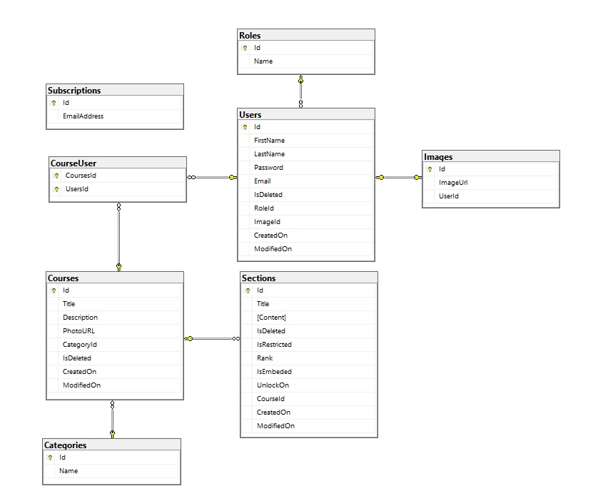

# [**POODLE**](#)

 ___e-Learning Platform___

# [Project Description](#)

Your task is to design the new system that will be used by Telerik Academy trainers to deliver online learning content.

The system consists of three main entities – **Users** (either teacher or student), **Courses** (either public or private) and **Sections**

**Teachers** can create courses, add **sections** to them and optionally enroll students.

**Students** can browse available courses and view their content

# [Functional Requirements](#)

- Each **user** *must* have an email, first name, last name, and a password

  - Teachers are predefined in the system
  - Newly registered users are students by default and cannot be promoted to teachers
  - The email serves as a username
- Each **course** *must* have a title (unique), description, and is either public/private and can later be augmented with **sections**
- Each **section** *must* have a title, content (HTML), *must* have order (integer), and *must* be restricted by date or for specific users, or have no restrictions. Its content *must* be configured to either open as a new page (default) or be embedded on the main course page (useful for small pieces of content)

## Public Part

The public part *must* be accessible without authentication i.e., for anonymous users.

Anonymous users *must* be able to see the title and description of available public courses, but not be able to open them.

Anonymous users *must* be able to login.

Anonymous users *must* be able to register

## Private part

Accessible only if the user is authenticated.

### *Main private page:*

**Students** *must* be able to see the courses that they are enrolled in (both public/private). Private courses are visible only if the student is enrolled and can&#39;t be accessed in any other way (such as manually typing in the URL)

**Students** *must* be able to see available public courses – if they visit one, they are automatically enrolled in it (on first visit)

**Teachers** *must* be able to see all courses

**Teachers** *must* have a link to a **create course page** (or the create course can be somehow embedded in the main page, either in a popup or some other way)

### *Create course view:*

Either individual page or part of the main page.

Must be accessible/visible only if the user is a **teacher**

Must have a form to create a new course – required inputs are title, description, and public/private check. Other data can be added later

*Could* have real-time validation that checks if the title is not already used by another course

### *Course page:*

Accessible to both students and teachers.

Students *must* be able to see all the available sections.

Sections are displayed sorted by their order ascending if it's implemented *should*

The section opens as a new page (default, must)– they see only the title and navigate to the section page on click

If *should* and *could* requirements be implemented:

If the section is embedded on the course page (*could*), then it is no longer a link, and the content is visible below the title

If the section is currently restricted (*should*), the restriction message is visible and the section can neither be opened, nor the content, can be seen, only the title and the message.

Students *could* see an unenroll button that removes them from the course and navigates them back to the main private page

Teachers must see everything that students can see. Date and user restrictions don't apply to them.

Teachers must see an **&quot;add section&quot;** link

If the course is private – teachers must see **&quot;enroll students&quot;** link

### *Add section page:*

Available to teachers only.

*Must* have an input for setting **title** and **content**. The content is expected to be HTML, so either use a text area input, or could integrate RTI like [Ace](https://ace.c9.io/). Think about potential problematic tags, when dealing with custom HTML.

*Should* have an input to set the **order** of the page. The other is calculated to be (the last section order + 1) but can be changed to any integer not used by another section on the current course.

*Should* have an input to either set a date **restriction** , or be available only to specific users (must be part of the course), or have no restriction (default)

*Could* have an input to configure the section to open as a new page (default) or be embedded in the course page

Must redirect back to the course page, after the section is added.

### *Enroll students page:*

Available to teachers only and opens for а specific private course.Must not open if the target course is public

*Must* provide a way to search for students that are currently not enrolled in the current course

*Must* provide a way to enroll single or multiple users

*Must* have a link back to the course page.

# [Use Cases](#)

## Learning Swedish

You plan on moving to Sweden. You search the web for free Swedish courses and find the Poodle website. You see an available course for Swedish, but on click you are redirected to the login form. After registering and logging, you can browse the course and there are tons of useful materials along with embedded videos of native speakers.

## Creating a course

You are a teacher that wants to create a new course. You add the title and description and mark the course as private. You visit the course page which is currently empty. You create several sections and add nice HTML markup for each one of them. In one of the sections, you embed a YouTube video. After you are finished, you click on the enroll students link and enroll 25 students to your course.

# [Technical Requirements](#)

## General

- Follow REST API design [best practices](https://blog.florimondmanca.com/restful-api-design-13-best-practices-to-make-your-users-happy) when designing the REST API (see Appendix)
- Use tiered project structure (separate the application in layers)
- You should implement proper error handling
- Try to think ahead. When developing something, think – &quot;How hard would it be to change/modify this later?&quot;

## Git

Commits in the GitLab repository should give a good overview of how the project was developed, which features were created first and the people who contributed. Contributions from all team members *must* be evident through the git commit history! The repository *must* contain the complete application source code and any scripts (database scripts, for example).

Provide a link to a GitLab repository with the following information in the README.md file:

  - Project description
  - Link to the hosted project (if hosted online)
  - Instructions how to setup and run the project locally
  - Images of the database relations (*must*)

## Optional Requirements

Besides all requirements marked as should and could, here are some more _optional_ requirements:

- Integrate your project with a Continuous Integration server (e.g., GitLab&#39;s own) and configure your unit tests to run on each commit to your master branch
- Host your application&#39;s backend in a public hosting provider of your choice (e.g., AWS, Azure, Heroku)
- Use branches while working with Git

# [Database Diagram](#)

# [Database Diagram](#)

